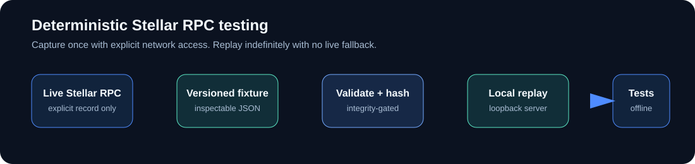

<p align="center">
  
</p>

<p align="center"><strong>Deterministic capture and replay for Stellar/Soroban RPC tests.</strong></p>

<p align="center">
  Capture a controlled read-only RPC interaction once, review its fixture, and replay it locally without live-network fallback.
</p>

<p align="center">
  <a href="https://github.com/StellarReplay/stellar-replay/releases/tag/v0.1.0"></a>
  <a href="https://github.com/StellarReplay/stellar-replay/actions/workflows/ci.yml"></a>
  <a href="LICENSE"></a>
  
</p>

<p align="center">
  <a href="#quickstart">Quick start</a> ·
  <a href="docs/ARCHITECTURE.md">Architecture</a> ·
  <a href="docs/COMMANDS.md">Commands</a> ·
  <a href="docs/RELEASES.md">Releases</a> ·
  <a href="CONTRIBUTING.md">Contributing</a>
</p>

> **Released:** v0.1.0. The core fixture, capture, replay, local server, and CLI workflow is implemented and verified. The companion Action and extended-docs repositories remain pre-release.

## What problem does this solve?

Tests that call a live Stellar RPC endpoint inherit provider drift, rate limits,
network failures, retention windows, and changing chain state. Stellar Replay
replaces that uncertainty with a versioned, validated fixture and a local replay
server.

<p align="center">
  
</p>

## v0.1 promise

Available commands are `record`, `inspect`, `validate`, `replay`, and `serve`. v0.1 supports read-only `getHealth`, `getLatestLedger`, `getNetwork`, and `getLedgerEntries`. It will not submit transactions, simulate transactions, execute contract code, or silently contact a live network during replay. The frozen request and endpoint policy is recorded in [docs/PHASE_1_DECISION.md](docs/PHASE_1_DECISION.md).

## Quickstart

Build the local binary, then record is the only command below that contacts a live
endpoint. It requires an explicit HTTPS endpoint and is opt-in:

```text
go build -o stellar-replay ./cmd/stellar-replay
stellar-replay record --rpc-url https://soroban-testnet.stellar.org \
  --network testnet --method getLatestLedger --output fixtures/latest-ledger.json
stellar-replay validate --fixture fixtures/latest-ledger.json
stellar-replay inspect --fixture fixtures/latest-ledger.json
stellar-replay replay --fixture fixtures/latest-ledger.json --method getLatestLedger
stellar-replay serve --fixture fixtures/latest-ledger.json --listen 127.0.0.1:8787
```

`replay`, `validate`, `inspect`, and `serve` are offline. `serve` remains running
until interrupted and exposes the fixture at `http://127.0.0.1:8787/`. See the
[fixture schema](docs/FIXTURE_SCHEMA.md), [capture contract](docs/CAPTURE.md),
[replay contract](docs/REPLAY.md), and [server contract](docs/SERVER.md) for
limits and exact behavior.

The default integration proof is also runnable without credentials or network:

```text
go test ./examples -run TestOfflineReplayWorkflow -count=1
```

See the executable [demo](docs/DEMO.md), [command reference](docs/COMMANDS.md),
[supported methods](docs/METHODS.md), and [troubleshooting guide](docs/TROUBLESHOOTING.md).

## Fixture philosophy

A fixture is a captured RPC interaction, not blockchain truth. It records request parameters, response or JSON-RPC error, network identity, provenance, schema version, and integrity information. A hash detects file modification; it does not prove that the endpoint was truthful or that the captured state remains current.

## Installation and contribution

The v0.1.0 release provides statically linked archives for Linux amd64, Windows
amd64, and macOS amd64. See [docs/RELEASES.md](docs/RELEASES.md) and the
[GitHub release](https://github.com/StellarReplay/stellar-replay/releases/tag/v0.1.0)
for installation and checksum verification. For source development, read
[CONTRIBUTING.md](CONTRIBUTING.md), [docs/ARCHITECTURE.md](docs/ARCHITECTURE.md),
and the current phase in [ROADMAP.md](ROADMAP.md).

Extended guides and integration documentation live in the companion [stellar-replay-docs](https://github.com/StellarReplay/stellar-replay-docs) repository. The [stellar-replay-action](https://github.com/StellarReplay/stellar-replay-action) repository is the pre-release integration boundary and will target the released core interface when its contract is implemented. This core README remains sufficient to understand the product and its boundaries.

## Security

The product is read-only by default. It must never require or capture secret keys, seed phrases, signing material, or authentication secrets. See [SECURITY.md](SECURITY.md) for reporting and [docs/SECURITY.md](docs/SECURITY.md) for the product threat model.

## License

Apache-2.0. See [LICENSE](LICENSE).
