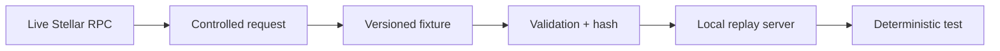

# Stellar Replay

Stellar Replay is a planned Go CLI for capturing selected Stellar RPC interactions as deterministic, inspectable fixtures and replaying them through a local JSON-RPC-compatible server.

> Status: the v0.1 fixture, capture, replay, local server, and CLI foundation are implemented. Cross-platform release packaging and the remaining workflow phases are still in progress.

## Why

Tests that call a live Stellar RPC endpoint inherit network failures, provider drift, rate limits, retention windows, and changing chain state. Stellar Replay will let a developer record a controlled interaction once, review what was captured, and run the same test offline against a local replay server.



## v0.1 promise

Available commands are `record`, `inspect`, `validate`, `replay`, and `serve`. v0.1 supports read-only `getHealth`, `getLatestLedger`, `getNetwork`, and `getLedgerEntries`. It will not submit transactions, simulate transactions, execute contract code, or silently contact a live network during replay. The frozen request and endpoint policy is recorded in [docs/PHASE_1_DECISION.md](docs/PHASE_1_DECISION.md).

## Quickstart

Build the local binary, then record is the only command below that contacts a live
endpoint. It requires an explicit HTTPS endpoint and is opt-in:

```text
go build -o stellar-replay ./cmd/stellar-replay
stellar-replay record --rpc-url https://soroban-testnet.stellar.org \
  --network testnet --method getLatestLedger --output fixtures/latest-ledger.json
stellar-replay validate --fixture fixtures/latest-ledger.json
stellar-replay inspect --fixture fixtures/latest-ledger.json
stellar-replay replay --fixture fixtures/latest-ledger.json --method getLatestLedger
stellar-replay serve --fixture fixtures/latest-ledger.json --listen 127.0.0.1:8787
```

`replay`, `validate`, `inspect`, and `serve` are offline. `serve` remains running
until interrupted and exposes the fixture at `http://127.0.0.1:8787/`. See the
[fixture schema](docs/FIXTURE_SCHEMA.md), [capture contract](docs/CAPTURE.md),
[replay contract](docs/REPLAY.md), and [server contract](docs/SERVER.md) for
limits and exact behavior.

## Intended walkthrough

```text
stellar-replay record --rpc-url https://soroban-testnet.stellar.org \
  --method getLatestLedger --params '{}'
stellar-replay inspect fixtures/latest-ledger.json
stellar-replay validate fixtures/latest-ledger.json
stellar-replay serve fixtures/latest-ledger.json --listen 127.0.0.1:8787
```

The exact flags and output are implementation work and must not be inferred from this sketch. The eventual demo is specified in [docs/DEMO.md](docs/DEMO.md).

## Fixture philosophy

A fixture is a captured RPC interaction, not blockchain truth. It records request parameters, response or JSON-RPC error, network identity, provenance, schema version, and integrity information. A hash detects file modification; it does not prove that the endpoint was truthful or that the captured state remains current.

## Installation and contribution

No release exists yet. The chosen distribution is a statically linked Go binary for Windows, Linux, and macOS. Read [CONTRIBUTING.md](CONTRIBUTING.md), [docs/ARCHITECTURE.md](docs/ARCHITECTURE.md), and the current phase in [ROADMAP.md](ROADMAP.md) before implementation.

Extended guides and integration documentation will live in the companion [stellar-replay-docs](https://github.com/StellarReplay/stellar-replay-docs) repository. The [stellar-replay-action](https://github.com/StellarReplay/stellar-replay-action) repository will provide the GitHub Actions integration after the core CLI has a released interface. This core README remains sufficient to understand the product and its boundaries.

## Security

The product is read-only by default. It must never require or capture secret keys, seed phrases, signing material, or authentication secrets. See [SECURITY.md](SECURITY.md) for reporting and [docs/SECURITY.md](docs/SECURITY.md) for the product threat model.

## License

Apache-2.0. See [LICENSE](LICENSE).

