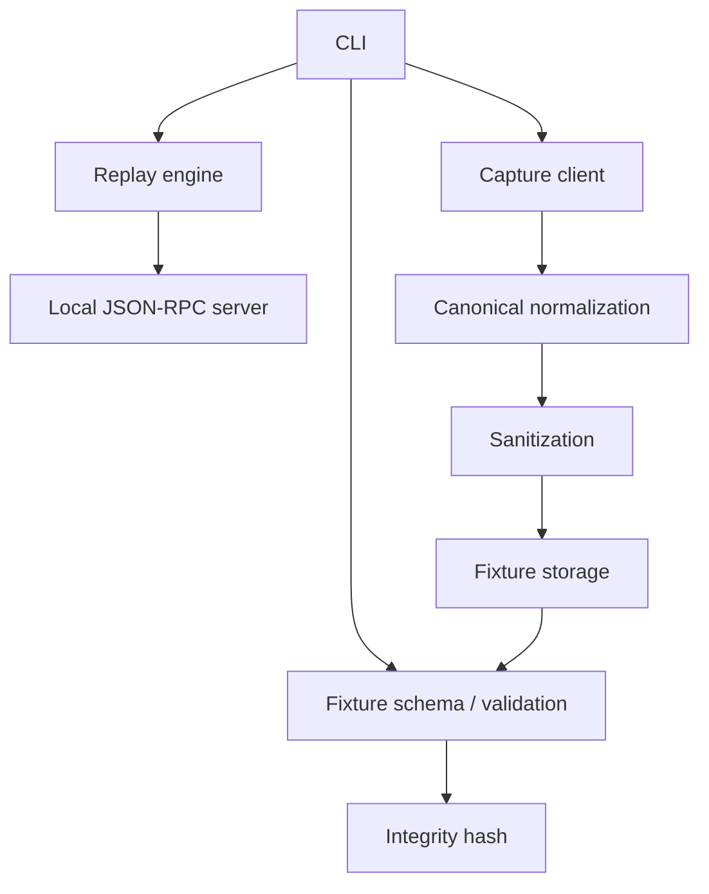
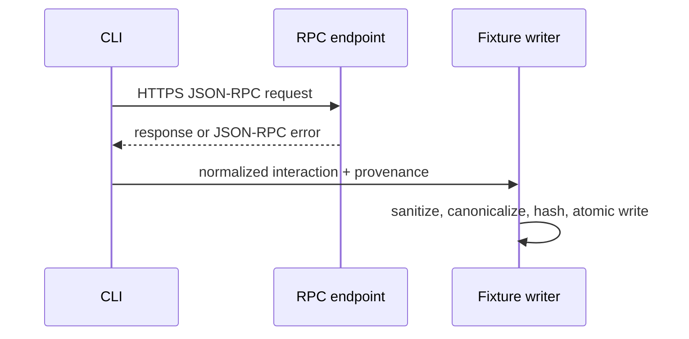

# Architecture

## Boundary

The CLI orchestrates narrow packages. Capture owns the live HTTP request and is the only component permitted to contact the configured endpoint. Fixture owns the versioned document and validation. Replay owns matching and deterministic response selection. Server translates HTTP JSON-RPC requests into replay calls. No replay component receives a live client.

## Capture flow

## Components

- `internal/capture`: bounded HTTP client, endpoint policy, request/response capture.
- `internal/fixture`: versioned schema, canonical JSON, validation, SHA-256, and
  bounded atomic storage. The contract is documented in
  [`FIXTURE_SCHEMA.md`](FIXTURE_SCHEMA.md).
- `internal/replay`: exact method/params matching and repeatable response selection.
- `internal/server`: HTTP transport, malformed-input handling, concurrency, shutdown.
- `internal/cli`: command parsing and user-facing errors.
- `cmd/stellar-replay`: minimal executable entry point.

Interfaces are limited to transport, fixture store, clock, and replay source where tests genuinely need substitution. There is no generic plugin framework in v0.1.

